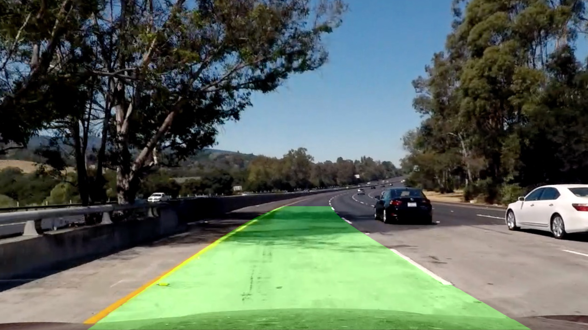
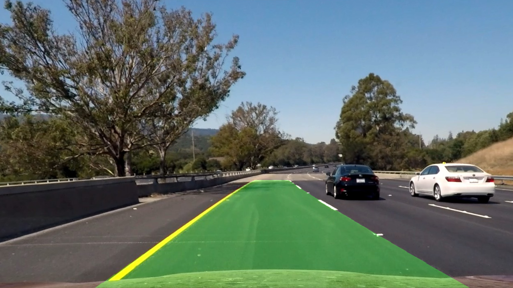

## Advanced Lane Finding

Advanced lane detection project for the Udacity Self-Driving Car Nanodegree by Oleksandr Semeniuta.

 

[The original project template](https://github.com/udacity/CarND-Advanced-Lane-Lines).
