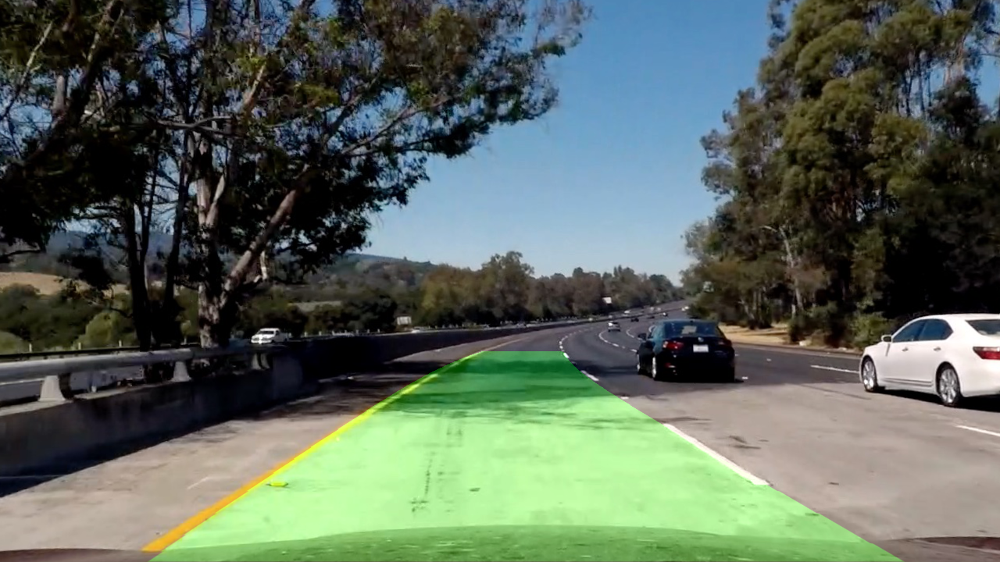

# **Advanced Lane Finding**

## Writeup

---

**Advanced Lane Finding Project**

The goals / steps of this project are the following:

* Compute the camera calibration matrix and distortion coefficients given a set of chessboard images.
* Apply a distortion correction to raw images.
* Use color transforms, gradients, etc., to create a thresholded binary image.
* Apply a perspective transform to rectify binary image ("birds-eye view").
* Detect lane pixels and fit to find the lane boundary.
* Determine the curvature of the lane and vehicle position with respect to center.
* Warp the detected lane boundaries back onto the original image.
* Output visual display of the lane boundaries and numerical estimation of lane curvature and vehicle position.


[//]: # (Image References)

[Pipeline]: ./output_images/pipeline.png "Pipeline"

[PipeInterm]: ./output_images/intermediate.jpg "Visualization of pipeline's intermediate results"

---

### System setup

The project uses the [carnd-term1](https://github.com/udacity/CarND-Term1-Starter-Kit) conda environment with additionally installed Graphviz and nxpd. These components can be installed via:

```
conda install graphviz
pip install graphviz pygraphviz nxpd
```

### Code overview

The pipeline for lane detection was built upon the computational graph implementation from the [EPypes project](https://github.com/semeniuta/EPypes). The idea is that you create a library of Python functions for certain application-specific computations, and later declaratively combine them into a directed acyclic graph. The latter can be run once its topological sort is performed. The graph can also be visualized with Graphviz. It is bipartite: the functions are shown as rectangles, and the data tokens -- as ellipses. The shaded ellipses correspond to *frozen* tokens, i.e. source tokens with fixed values. They represent tuned parameters of a vision algorithm. The vendored code from EPypes can be found in `graph.py` and `compgraph.py` modules.

The core functions used in the developed pipeline reside in the `lanelines.py` Python module.

`calib.py` contains functions for camera calibration. When used as a script (`python calib.py`), performs camera calibration using the images in `camera_cal` and saves the results as `serialize/{camera_matrix.npy, dist_coefs.npy}`.

The computational graph for the lane detection pipeline is defined in `newlanespipeline.py`.

The computational graph for simplified lane detection from the [Project 1](https://github.com/semeniuta/CarND-LaneLines-P1) is used in this project (as `straightlanespipeline.py`) for aiding definition of the road plane region for birds-eye warping. Functions that perform the latter task reside in `roadplane.py`.

Computational primitives for frame-to-frame smoothing can be found in `smooth.py`.

All the resulting media files are generated by the `genmedia.py` script.

## Undistortion

The results of undistortion and warping of a chessboard image are visualized below:

 

## Computer vision pipeline

The computational graph, defined in `newlanespipeline.py` has the following structure:

![alt text][Pipeline]

An undistorted RGB image is warped to the birds-eye perspective, with the supplied transformation matrix `M`. The warped image undergoes a number of processing strategies to obtain several binary images highlighting lane-lines pixels:

* thresholding of the grayscale image
* color transformation to the HLS space, followed by:
    * "two-ends" thresholding of the S channel, followed by the [closing](https://docs.opencv.org/3.4.1/d9/d61/tutorial_py_morphological_ops.html) operation
    * applying Sobel operator to the S channel in the `x` direction, followed by "two-ends" thresholding and median blur
    * weighted sum of H, L, and S channels (with factors [0, 0.4, 1.], thus corresponding to "enriching" the S channel with a bit of L), followed by "two-ends" thresholding.

The results of the above processing strategies are further combined in a single binary image (`all_thresholds`) by bitwise-OR operator.

Two sets of pixel points (for the left and the right lane-lines respectively) are identified by the following technique:

* An image is divided into the left and right half
* Each half is divided in equally-sized cells (small rectangular regions)
* In every cell, the sum of pixel intensities is computed
* For every cell row in a half of the original image, the one with maximal intensities sum is chosen as a target cell
* Center coordinates of the target cells (for both the left and the right half) are used for polynomial estimation

The following figure shows the results of vision pipeline processing of the test images (`all_thresholds` and the estimated polynomials):

![alt text][PipeInterm]

Figures below demonstrate the final rendering of the detected lane (note that the resulting image is in addition undistorted):

 

The result of video processing is stored in `output_images/project_video.mp4`.

### Smoothing

Since subsequent frames in a video are correlated, it is beneficial to exploit measurements from previous frames to smooth estimates and reject outliers from the current frame.

To process the project video, two smoothing operations are performed:

* Polynomial coefficients (`p_coefs_left` and `p_coefs_right`) are checked by how much they differ with the previous frame's estimation. If the absolute difference of any of the coefficients is above the threshold, the previous values are used. Otherwise, the coefficients' values are averaged with the previous ones.

* Curvature is smoothed in a similar way, but with averaging over a window of previous measurements.

### Shortcomings and possible improvements

Even though the proposed algorithm possesses better robustness comparing to single threshold solutions, it remains sensitive to color variations in the stream of images.

The cell-based algorithm for detecting points further used for polynomial estimation can be improved. Specifically, in its current form, if several subsequent cells in a row have the same intensity sum value, it chooses the left-most cell. It should instead aim at the middle of such sequence.

More precise calibration of pixel-to-meter ratios should be done to obtain realistic curvature measurements.

Curvature is in general very sensitive to the values of polynomial coefficients. A more complex smoothing strategy may be beneficial to estimating curvature. Another possibility is to use discrete sets approach, where high values of curvature would be characterized by a distinct discrete class of "straight road", with additional classes for different combinations of road turning direction and curvature ranges.
